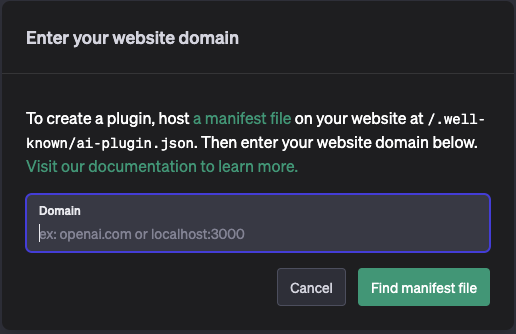
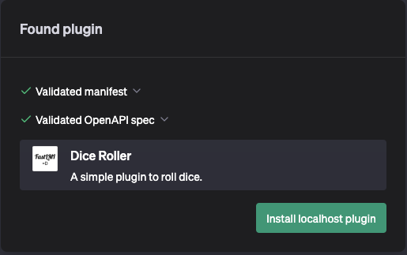
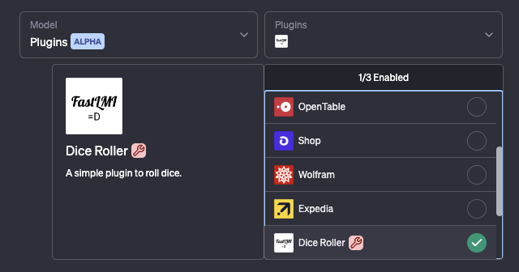
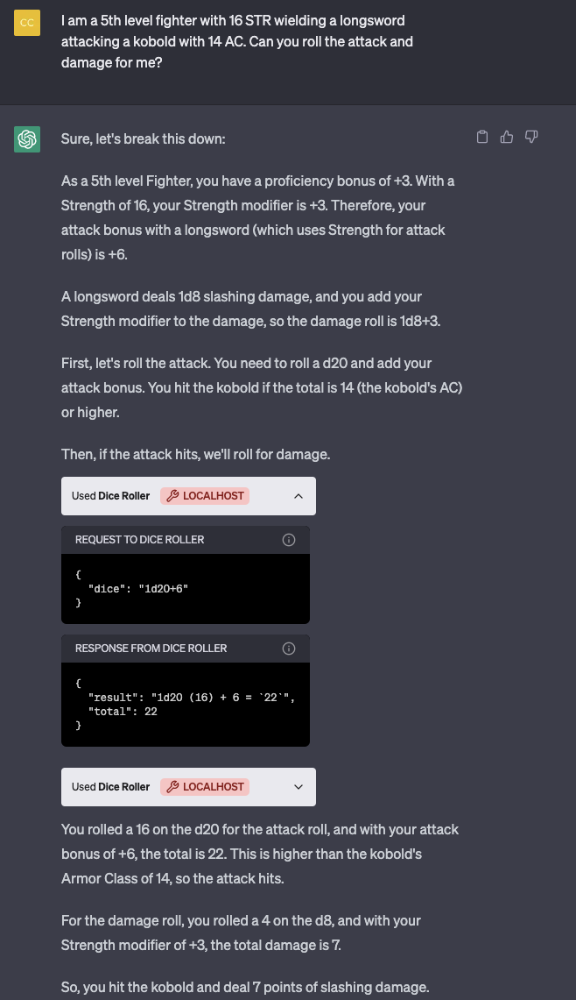

# FastLMI

FastLMI is a modern, fast (both in performance and development time) framework for creating LMIs, based on the beloved
[FastAPI](https://github.com/tiangolo/fastapi) library.

## What is an LMI?

*and why not just call it an API?*

LMI stands for "**Language Model Interface**" -- it's a catch-all term for tools given to AI agents that can interact
with them, and how we define those tools (interfaces). We aren't providing an application programming interface;
rather than providing instructions (in the form of docs) for human developers to write apps, LMIs come bundled with
instructions for AI agents to interface with them.

FastLMI is more than just a library for making ChatGPT plugins -- we believe the LMI ecosystem has the potential to be
and do much more without relying on a single authority to curate and provide "good" plugins. FastLMI is designed to be
ecosystem-agnostic with adapters for popular ecosystems, such as ChatGPT/OpenAI plugins.

## Cite Us

Doing academic research on language models and their abilities to use tools using the FastLMI library? Cite us with
this BibTex entry!

```bibtex
@software{Zhu_FastLMI_2023,
    author = {Zhu, Andrew},
    doi = {10.5281/zenodo.7916737},
    month = may,
    title = {{FastLMI}},
    url = {https://github.com/zhudotexe/fastlmi},
    version = {0.1.0},
    year = {2023}
}
```

## Requirements

Python 3.8+

## Installation

```shell
$ pip install fastlmi
```

Just as with FastAPI, you will need an ASGI server to run the app, such as [Uvicorn](https://www.uvicorn.org/).

```shell
$ pip install uvicorn
# or pip install "uvicorn[standard]" for Cython-based extras 
```

## Example (OpenAI/ChatGPT Plugin)

> NOTE: As of v0.2.0 FastLMI includes the AI Plugin (OpenAI, LangChain) interface as a default. This may change to an
> extension-based system in the future as the library develops.

To show off just how easy it is to create a plugin, let's make a ChatGPT plugin that gives it the ability to roll dice
in the d20 format (AIs playing D&D, anyone?).

### Example Requirements

First, you'll need to install the [`d20`](https://github.com/avrae/d20) library:

```shell
$ pip install d20
```

### Create it

Then, create a `main.py` file.

```python
import d20  # pip install d20
from fastlmi import FastLMI, utils
from pydantic import BaseModel

app = FastLMI(
    title="Dice Roller",
    name_for_model="DiceRoller",
    description="A simple plugin to roll dice.",
    description_for_model=(
        "DiceRoller can roll dice in XdY format and do math.\n"
        "Some dice examples are:\n"
        "4d6kh3 :: highest 3 of 4 6-sided dice\n"
        "2d6ro<3 :: roll 2d6s, then reroll any 1s or 2s once\n"
        "8d6mi2 :: roll 8d6s, with each die having a minimum roll of 2\n"
        "(1d4 + 1, 3, 2d6kl1)kh1 :: the highest of 1d4+1, 3, and the lower of 2 d6s\n"
        "Normal math operations are also supported."
    ),
    contact_email="foo@example.com",
    legal_url="https://example.com/legal",
)
# use this when developing localhost plugins to allow the browser to make the local request
utils.cors_allow_openai(app)


class DiceRequest(BaseModel):
    dice: str  # the dice to roll


class DiceResponse(BaseModel):
    result: str  # the resulting dice string
    total: int  # the total numerical result of the roll (rounded down to nearest integer)


@app.post("/roll")
def roll(dice: DiceRequest) -> DiceResponse:
    """Roll the given dice and return a detailed result."""
    result = d20.roll(dice.dice)
    return DiceResponse(result=result.result, total=result.total)
```

_(this example script is also available at `examples/dice_roller.py`!)_

### Run it

... and run it with:

```shell
$ uvicorn main:app

INFO:     Uvicorn running on http://127.0.0.1:8000 (Press CTRL+C to quit)
INFO:     Started server process [53532]
INFO:     Waiting for application startup.
INFO:     Application startup complete.
```

### Register it

Finally, we need to tell ChatGPT about the new plugin.
In the ChatGPT interface, select the "Plugins" model, then head to the Plugin Store -> Develop your own plugin.

Here, type in the address of your plugin. By default, it's `localhost:8000`.



Click "Find manifest file," and you should see your plugin appear. FastLMI automatically handles generating all the
plugin metadata needed by OpenAI!



### Chat away

To use your new plugin, select it from the list of plugins when starting a new chat:



and start chatting. Congratulations! 🎉 You've just created a brand-new ChatGPT plugin - and we're excited to see what
else you'll make!



## Example (LangChain Tool)

LangChain supports
[interfacing with AI plugins](https://python.langchain.com/en/latest/modules/agents/tools/examples/chatgpt_plugins.html)!
If you've followed the steps above (at least up through "Run it"), you can also expose your new LMI to a LangChain
agent.

This example assumes that you
have [LangChain](https://python.langchain.com/en/latest/getting_started/getting_started.html) installed, and that your
LMI is running at `http://localhost:8000`.

```python
from langchain.agents import AgentType
from langchain.agents import initialize_agent, load_tools
from langchain.chat_models import ChatOpenAI
from langchain.tools import AIPluginTool

tool = AIPluginTool.from_plugin_url("http://localhost:8000/.well-known/ai-plugin.json")
llm = ChatOpenAI(temperature=0)
tools = load_tools(["requests_all"])
tools += [tool]

agent_chain = initialize_agent(tools, llm, agent=AgentType.CHAT_ZERO_SHOT_REACT_DESCRIPTION, verbose=True)
agent_chain.run("Can you roll me stats for a D&D character?")
```

## Authentication

As of v0.2.0, FastLMI has built-in support for service-level auth, where the AI agent or LMI driver will send an
authorization token you decide as a header with each request.

Enabling authentication is easy! First, define the authentication scheme you wish to use - this will be a subclass of
`LMIAuth`. For example, to provide service-level auth, you can define the `LMIServiceAuth` scheme:

```python
from fastlmi import Depends, FastLMI
from fastlmi.auth import LMIServiceAuth

auth = LMIServiceAuth(
    access_tokens=["your_secret_token_here"],
    verification_tokens={"openai": "verification_token_generated_in_the_ChatGPT_UI"}
)
```

This auth scheme allows defining a set of allowed access tokens (if one wanted to, for example, have a different
token for each plugin service). Then, when you define your app, all you have to do is add 2 parameters:

```python
app = FastLMI(..., auth=auth, dependencies=[Depends(auth)])
```

Tada! 🎉 Your LMI now tells consumers that it uses the `service_http` auth scheme, and will validate that each request
to one of your defined routes provides a valid Bearer token.

A complete example is in `examples/ai_plugin_auth.py`. You can read more about OpenAI's service-level
auth [here](https://platform.openai.com/docs/plugins/authentication/service-level).

### Route-Level Auth

If you wanted to only require that certain routes use auth, you can also define the auth dependency on a route level:

```diff
- app = FastLMI(..., auth=auth, dependencies=[Depends(auth)])
+ app = FastLMI(..., auth=auth)
...
- @app.post("/hello")
+ @app.post("/hello", dependencies=[Depends(auth)])
def hello():
    ...
```

## Read More

Being based on FastAPI, FastLMI can take full advantage of its superpowers. Check out
the [FastAPI documentation](https://fastapi.tiangolo.com/) for more!

## Todo

- scopes
- script to check for missing docs, over limits, etc
- logging
- configure ecosystems

<!--
For developers:

## Build and Publish

`fastlmi` uses Hatchling to build.

Make sure to bump the version in pyproject.toml before publishing, then update CITATION.cff + README.md with the latest
citation from zenodo after the release is indexed.

```shell
python -m build
python -m twine upload dist/*
```
-->
